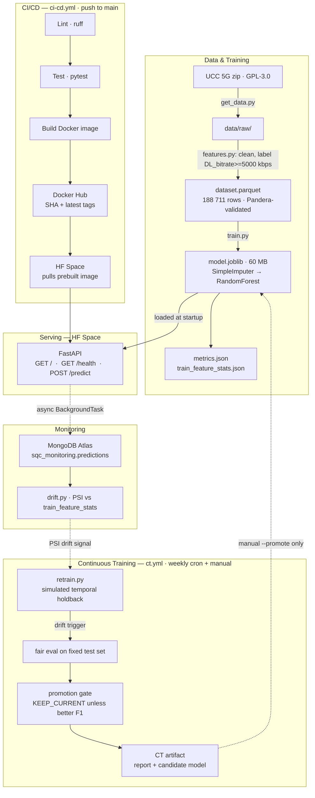

# Service Quality Checker

A binary 5G/LTE **QoS Pass/Fail classifier** built as a full MLOps end-to-end
project. Given five radio and mobility measurements at a point — RSRP, RSRQ, SNR,
CQI, and device speed — it predicts whether that location is likely to deliver
adequate downlink throughput (≥ 5 Mbps). The tool is a **screening and triage
instrument**: it surfaces candidate problem locations for human review by field
engineers. It is not a verdict engine and must not be used for automated penalties,
billing adjustments, or SLA enforcement without human oversight. See
[`docs/MODEL_CARD.md`](docs/MODEL_CARD.md) for the full limitations and ethical
considerations.

---

## Live Demo

| Endpoint | URL |
|---|---|
| Prediction API | https://musmanbinyounas-service-quality-checker.hf.space/predict |
| Health check | https://musmanbinyounas-service-quality-checker.hf.space/health |
| Interactive docs (Swagger) | https://musmanbinyounas-service-quality-checker.hf.space/docs |

**Quick test:**
```bash
curl -s -X POST https://musmanbinyounas-service-quality-checker.hf.space/predict \
  -H "Content-Type: application/json" \
  -d '{"RSRP":-75,"RSRQ":-8,"SNR":20,"CQI":14,"Speed":0}'
# → {"prediction":"Pass","label":1,"pass_probability":0.6901,...}
```

---

## Architecture



---

## MLOps Lifecycle — Stage Map

| Stage | What | Where in repo |
|---|---|---|
| 1 | Source control, repo structure | `.github/`, `pyproject.toml` |
| 2 | Data ingestion & protection | `src/sqc/ingest.py`, `scripts/get_data.py` |
| 3 | Data validation | `src/sqc/validate.py` (Pandera schema) |
| 4 | CI pipeline | `.github/workflows/ci-cd.yml` (lint + hermetic tests) |
| 5 | Model training | `src/sqc/train.py`, `reports/metrics.json` |
| 6 | Serving & deployment | `app/`, `Dockerfile`, Docker Hub → HF Space |
| 7 | Monitoring | `src/sqc/store.py`, `src/sqc/drift.py`, MongoDB Atlas |
| 8 | Continuous training (simulated) | `src/sqc/retrain.py`, `.github/workflows/ct.yml` |
| 9 | Governance & compliance | `docs/MODEL_CARD.md`, `docs/DATASET_CARD.md`, this README |

---

## Quickstart

```bash
# 1. Clone and create a virtual environment
git clone https://github.com/musmanbinyounas-boop/service-quality-checker.git
cd service-quality-checker
python -m venv .venv && source .venv/Scripts/activate   # Windows Git Bash
# source .venv/bin/activate                             # macOS / Linux

# 2. Install all dependencies
pip install -e .

# 3. Download the raw dataset (~2.1 MB zip, extracts to 83 CSVs)
python scripts/get_data.py

# 4. Build the processed dataset (188,711 rows -> data/processed/dataset.parquet)
python -m sqc.features

# 5. Train the model (writes models/model.joblib + reports/)
python -m sqc.train

# 6. Run the API locally
uvicorn app.main:app --reload --port 8000
# -> http://localhost:8000/docs   (Swagger UI)
# -> http://localhost:8000/health
```

**Drift detection:**
```bash
# Against a local file
python -m sqc.drift --source file data/processed/dataset.parquet

# Against live MongoDB predictions (requires MONGODB_URI env var)
export MONGODB_URI='mongodb+srv://...'
python -m sqc.drift --source mongo --limit 2000
```

**Continuous training (simulated):**
```bash
# Dry run: check drift, retrain, write CT report — do NOT promote
python -m sqc.retrain --drift-source holdback --force

# Promote the candidate model if the gate passes
python -m sqc.retrain --drift-source holdback --force --promote
```

---

## Testing

```bash
ruff check src tests app scripts   # lint (zero violations expected)
pytest -q                          # 39 hermetic tests, ~30 s
```

All tests are **hermetic** — no real MongoDB connection, no dataset download,
no model artifact access. Tests use synthetic DataFrames constructed within the
test files. The CI pipeline enforces both checks on every push to `main`.

---

## Project Layout

```
src/sqc/
  config.py      — central config (features, threshold, Mongo settings)
  ingest.py      — dataset download and CSV discovery
  features.py    — raw CSV -> cleaned dataset.parquet
  validate.py    — Pandera schema validation
  train.py       — training pipeline (both models, saves bundle)
  store.py       — MongoDB persistence (fault-tolerant, lazy singleton)
  drift.py       — PSI drift detection + CLI
  retrain.py     — simulated CT pipeline + CLI
app/
  main.py        — FastAPI app (/health, /predict + Mongo BackgroundTask)
  schemas.py     — Pydantic request/response models
tests/           — pytest suite (39 hermetic tests)
scripts/
  get_data.py    — dataset download CLI
docs/
  MODEL_CARD.md  — model card (architecture, metrics, limitations)
  DATASET_CARD.md — dataset card (schema, license, lineage)
.github/workflows/
  ci-cd.yml      — lint -> test -> Docker build/push -> Space deploy
  ct.yml         — weekly simulated CT (no auto-deploy)
reports/
  metrics.json            — both models' evaluation metrics
  train_feature_stats.json — PSI reference distribution (committed)
  drift/                  — drift reports (gitignored at runtime)
  ct/                     — CT reports + candidate models (gitignored)
```

---

## Governance

- **Model card:** [`docs/MODEL_CARD.md`](docs/MODEL_CARD.md) — architecture,
  evaluation metrics, monitoring setup, and five specific limitations that must
  be understood before any operational use.
- **Dataset card:** [`docs/DATASET_CARD.md`](docs/DATASET_CARD.md) — data
  lineage, schema, preprocessing steps, class balance, and license terms.

---

## Dataset License & Attribution

The training data is the **UCC 5G Dataset**, released under **GPL-3.0**.

> Raca, D., Leahy, D., Sreenan, C. J., & Quinlan, J. J. (2020).
> *Beyond Throughput, the Next Generation: A 5G Dataset with Channel and
> Context Metrics.* Proc. 11th ACM Multimedia Systems Conference (MMSys '20).
> https://github.com/uccmisl/5Gdataset

Any derivative work that incorporates or was trained on this dataset must comply
with GPL-3.0. **This dataset is not CC-BY licensed.**
